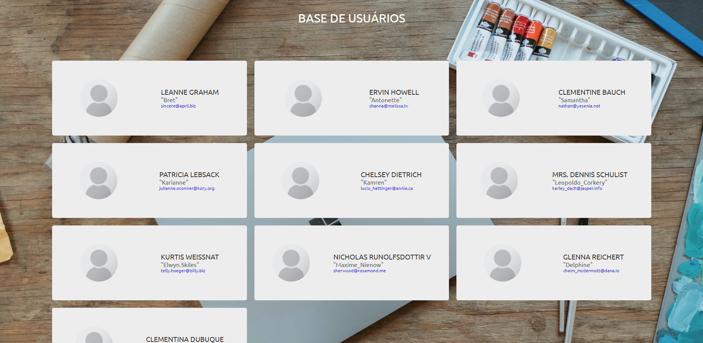
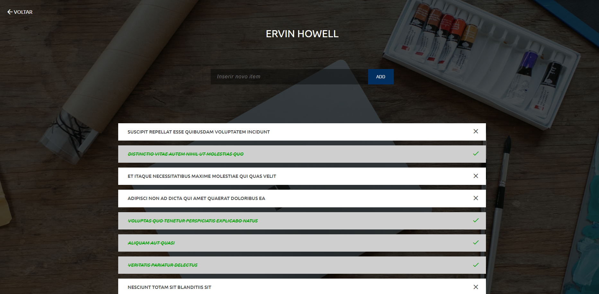

# <a href="https://users-todolist.netlify.app/">🔗 Users todo List</a>

 

## Sobre o projeto  

 Essa aplicação foi desenvolvida utilizando o React com a API da {JSON} Placeholder}, uma fake api com dados de usuários e lista de tarefas.
 Para estilização optei por usar o styled-components por ser uma nova tecnologia que estou aprendendo. Também utilizei o Axios para os request da API por ser mais prático do que o Fetch nativo do DOM do browser.
 Nessa aplicação ao clicar em um usuário o abre-se uma nova página contento toda a lista de tarefa desse usuário, algumas já marcadas
 como completas e outras não. Também é possível marcar ou desmarcar qualquer tarefa como completa como adicionar uma nova às já existentes.  

---

## Funcionalidades
- Visualizar todos os usuários na página inicial;
- Visualizar tarefas de cada usuário, já concluídas e pendentes;
- Inserir novas tarefas e marcá-las como concluída ou não; 

 ## Tecnologias utilizadas nessa aplicação

- <a href="https://pt-br.reactjs.org/"> React </a> 
- <a href="https://axios-http.com/ptbr/docs/intro"> Axios </a>
- <a href="https://jsonplaceholder.typicode.com"> Json Placeholder </a> 
- <a href="https://styled-components.com/"> Styled-components</a>

 ## Como ter essa aplicação em ambinente local
 - Na página desse projeto no Github clique em "Code", baixe o Zip ou copie o link  do HTTPS. 
 - Abra um terminal em uma pasta de sua escolha e cole o link HTTPS. 
 - Certifique-se de ter instalado o Node em uma versão suiperior a 14.0. 
 - Após baixar o pojeto em um diretório de sua escolha digite o comando "npm install". 
 - Após o término de todas as depedências serem baixadas pelo npm digite no mesmo diretório o comando "npm start". 
 - O seu navegador padrão irá mostrar uma nova aba com o projeto já pronto para ser usado 
 - Caso o navegado não inciar, digite o seguinte comando "http://localhost:3000" em uma nova aba. 
